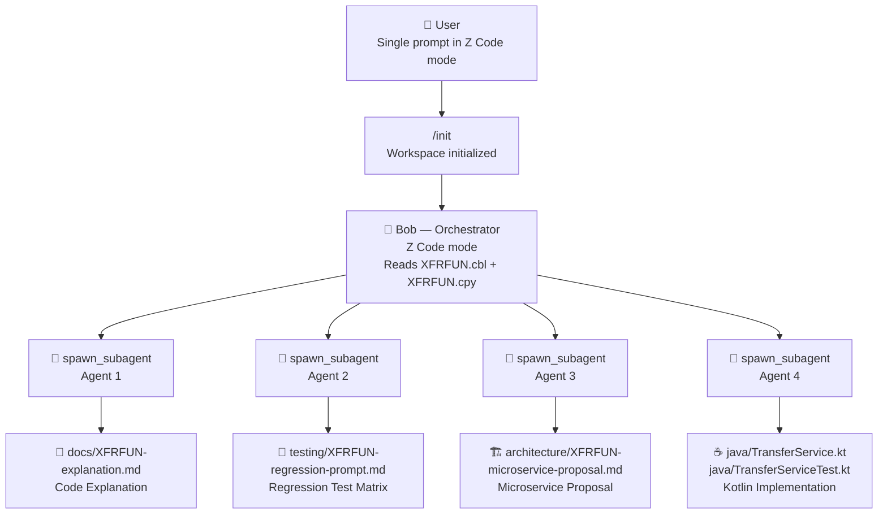

# Agent Design — Legacy Modernization Accelerator

> **IBM Bob Hackathon 2026**  
> **Team:** Jorge Hernandez & Stephanie Rojas  
> **Program analyzed:** `XFRFUN.cbl` — Bank-of-Z Fund Transfer (IBM Corp. 2023)

This document describes how IBM Bob's agent orchestration was used to generate all modernization artifacts for `XFRFUN.cbl` in a single, fully automated run — and includes the used prompts so that anyone can reproduce the workflow.

---

## 1. Workflow Overview

A single prompt in **Z Code mode** triggered Bob to spawn **four parallel subagents**, each independently generating one artifact from the same COBOL source. The entire suite was produced in one run with no manual intervention between steps.



---

## 2. Agent Roles

| Agent | Role | Output | Tools Used |
|---|---|---|---|
| **Orchestrator** | Reads source, coordinates all subagents | — | `scan_program`, `get_paragraphs`, `get_variables`, `get_control_flow`, `spawn_subagent` |
| **Agent 1 — Explainer** | Deep technical analysis of COBOL program | [`docs/XFRFUN-explanation.md`](docs/XFRFUN-explanation.md) | `scan_program`, `get_paragraphs`, `get_control_flow`, `write_file` |
| **Agent 2 — Test Engineer** | Regression test prompt + 15-case test matrix | [`testing/XFRFUN-regression-prompt.md`](testing/XFRFUN-regression-prompt.md) | `scan_program`, `get_paragraphs`, `write_file` |
| **Agent 3 — Architect** | Microservice decomposition + Saga design + Strangler Fig plan | [`architecture/XFRFUN-microservice-proposal.md`](architecture/XFRFUN-microservice-proposal.md) | `scan_program`, `get_control_flow`, `write_file` |
| **Agent 4 — Developer** | Kotlin Spring Boot implementation + 18 JUnit 5 tests | [`java/TransferService.kt`](java/TransferService.kt), [`java/TransferServiceTest.kt`](java/TransferServiceTest.kt) | `scan_program`, `get_paragraphs`, `write_file` |

> All four subagents ran **in parallel** — no ordering dependency between them. Each received a copy of the program analysis context and operated independently.

---

## 3. Bob Configuration

### Mode
**Z Code mode** — provides deep COBOL/CICS/DB2 context, access to `scan_program`, `get_paragraphs`, `get_variables`, `get_control_flow`, and `get_expanded_source` tools.

### Workspace
Two workspaces were active simultaneously:
- `Bank-of-Z/` — source repository containing `XFRFUN.cbl` and `XFRFUN.cpy`
- `Legacy-Modernization/` — output repository where all artifacts were written

### Key Bob Tools Used

| Tool | Purpose |
|---|---|
| `scan_program` | Parse COBOL structure — divisions, sections, paragraphs |
| `get_paragraphs` | Extract named paragraph bodies (e.g., `PREMIERE`, `UPDATE-ACCOUNT-DB2`) |
| `get_variables` | Extract Working Storage and Local Storage variable definitions |
| `get_control_flow` | Understand `GO TO`, `PERFORM`, `EXEC CICS LINK` call chains |
| `get_expanded_source` | Resolve COPY members (e.g., `XFRFUN.cpy` COMMAREA definition) |
| `spawn_subagent` | Launch independent agents for each artifact in parallel |
| `write_file` | Write generated artifacts to `Legacy-Modernization/` |

---

## 4. Reconstructed Prompts

### 4.1 — Initialization

Before the main prompt, `/init` was run to register both workspaces and give Bob context about the project structure.

---

### 4.2 — Main Orchestration Prompt

This is the prompt that triggered the full parallel generation:

> Analyze the program `XFRFUN.cbl` from Bank-of-Z, understand the business logic using Document Understanding, generate automatic regression tests, propose the equivalent microservice architecture, and produce Java/Kotlin code — all with parallel subagents.

---

### 4.3 — Reconstructed Sub-Prompts

The orchestrator internally issued the following focused instructions to each subagent. These are reconstructed from the artifacts produced.

#### Agent 1 — Code Explanation (`docs/XFRFUN-explanation.md`)

```
You are a senior mainframe architect analyzing XFRFUN.cbl (Bank-of-Z).

Using the scanned program structure, produce a complete technical explanation in Markdown covering:
1. Executive summary (what the program does, key capabilities)
2. Architecture context (CICS runtime, DB2, callers, abend handler)
3. COMMAREA interface table (all input/output fields with PIC clauses, direction, description)
4. Failure codes table
5. Program flow — full Mermaid flowchart + section-by-section walkthrough
6. Business rules (numbered list, precise statements)
7. DB2 interaction — tables accessed, SQL patterns, SQLCODE handling table
8. Error handling and abend codes table (code, section, cause, recovery)
9. Deadlock handling strategy (Layer 1: prevention via lock ordering; Layer 2: retry logic)
10. Storm drain / WLM integration
11. Known limitations and modernization notes table

Write as production-quality technical documentation. Include Mermaid diagrams where appropriate.
Output to: docs/XFRFUN-explanation.md
```

---

#### Agent 2 — Regression Testing (`testing/XFRFUN-regression-prompt.md`)

```
You are a mainframe testing expert working with XFRFUN.cbl (Bank-of-Z).

Produce a Markdown document with two sections:

SECTION 1 — AI PROMPT: Write a complete, self-contained prompt that a user could paste into
any AI assistant to generate a full regression test suite for XFRFUN. The prompt must include:
- Full COMMAREA interface specification
- All 11 business rules
- Instructions to generate GIVEN/WHEN/THEN test cases for 15 specific scenarios (TC-001 to TC-015)
- Requirement for a CICS test harness stub in COBOL pseudo-code

SECTION 2 — TEST MATRIX: Generate the full 15-case test matrix as a Markdown table with columns:
Test ID | Test Name | Description | FROM Sort/Account | TO Sort/Account | Amount |
Pre-condition | Expected COMM-SUCCESS | Expected COMM-FAIL-CODE | Expected PROCTRAN Records | Expected Abend

Cover all paths: happy paths (lock order both ways), zero/negative amount, same account,
FROM not found, TO not found, DB2 error, deadlock retry success, deadlock exhausted,
PROCTRAN failures, SYNCPOINT ROLLBACK failure, boundary values, overdraft by design.

Output to: testing/XFRFUN-regression-prompt.md
```

---

#### Agent 3 — Microservice Architecture (`architecture/XFRFUN-microservice-proposal.md`)

```
You are a cloud-native architect modernizing XFRFUN.cbl (Bank-of-Z) to microservices.

Produce a Markdown architecture proposal covering:
1. Executive summary — current monolith constraints
2. Current state analysis — Mermaid graph of tightly coupled sections + coupling issues table
3. Target microservice architecture:
   - Service map (Mermaid graph): TransferOrchestrationService, AccountService,
     TransactionLedgerService, ValidationService
   - Definition of each service (responsibility, endpoints, DB ownership, COBOL equivalent)
4. Saga pattern design:
   - Orchestration vs Choreography recommendation with justification
   - Happy path sequence diagram (Mermaid)
   - Failure/compensation sequence diagram (Mermaid)
5. REST API contract (request/response JSON, error codes mapped to COBOL fail codes)
6. Deadlock/concurrency strategy — COBOL mechanism vs modern replacement table + Resilience4j config snippet
7. COBOL-to-microservice mapping table (every significant COBOL element mapped to its service equivalent)
8. Migration strategy — Strangler Fig (5 phases, Mermaid Gantt chart)
9. Technology recommendations table

Output to: architecture/XFRFUN-microservice-proposal.md
```

---

#### Agent 4 — Kotlin Implementation (`java/TransferService.kt` + `java/TransferServiceTest.kt`)

```
You are a senior Kotlin/Spring Boot developer implementing XFRFUN.cbl (Bank-of-Z) as a
modern cloud-native service.

Produce TWO files:

FILE 1 — java/TransferService.kt:
Implement a production-quality Spring Boot 3 service that replicates ALL XFRFUN business logic.
Requirements:
- Kotlin data classes for TransferRequest, TransferResult, Account, ProcessedTransaction
- Spring Data JPA repositories for Account and ProcessedTransaction
- TransferService with @Transactional executeTransfer() method
- Preserve COBOL lock ordering: always lock lower account number first (SELECT FOR UPDATE)
- Resilience4j Retry (maxAttempts=5, replaces DB2-DEADLOCK-RETRY + EXEC CICS DELAY)
- Resilience4j CircuitBreaker (replaces storm drain / CPSM WLM)
- Spring Boot exception hierarchy matching all COBOL fail codes and abend codes
- KDoc comments on every method tracing back to the COBOL section it replaces
  (e.g., /** Equivalent to COBOL section UPDATE-ACCOUNT-DB2-FROM (UADF010) */)
- OpenTelemetry span annotations
- No overdraft check (intentional — matches COBOL design)

FILE 2 — java/TransferServiceTest.kt:
Write 18 JUnit 5 + Mockito regression tests covering every scenario from the test matrix
(TC-001 through TC-015 plus edge cases). Use @ExtendWith(MockitoExtension::class).
Each test must include a comment referencing the corresponding test case ID.

Output files to: java/TransferService.kt and java/TransferServiceTest.kt
```

---

## 5. Parallelism and Execution Time

All four subagents were launched simultaneously by the orchestrator after the initial program scan. Because each agent operated on an independent output path (no shared file writes), there were no conflicts.

```mermaid
gantt
    title Parallel Artifact Generation (single Bob run)
    dateFormat  ss
    axisFormat  %Ss

    section Orchestrator
    /init + scan_program + get_paragraphs   :done, 00, 15s

    section Parallel Subagents
    Agent 1 — Code Explanation              :active, 15, 45s
    Agent 2 — Regression Tests             :active, 15, 30s
    Agent 3 — Architecture Proposal        :active, 15, 50s
    Agent 4 — Kotlin Implementation        :active, 15, 60s
```



> **Estimated total wall-clock time:** ~1–2 minutes for the full modernization suite.  
> **Equivalent manual effort:** 2–4 weeks (documentation, test design, architecture, implementation).

---

## 6. Reproducibility

To reproduce this workflow on a different COBOL program:

1. Open both workspaces in Bob (`/init`)
2. Switch to **Z Code mode**
3. Paste the main prompt (section 4.2), replacing `XFRFUN.cbl` with your target program
4. Bob will scan the program, then spawn the four parallel subagents
5. Artifacts will appear in `Legacy-Modernization/docs/`, `testing/`, `architecture/`, and `java/`

The sub-prompts in section 4.3 can be adapted individually if you only need specific artifacts.

---

*Built with [IBM Bob](https://www.ibm.com/products/ibm-watsonx-code-assistant) — AI-powered mainframe modernization.*  
*IBM Bob Hackathon 2026 — Jorge Hernandez & Stephanie Rojas*
