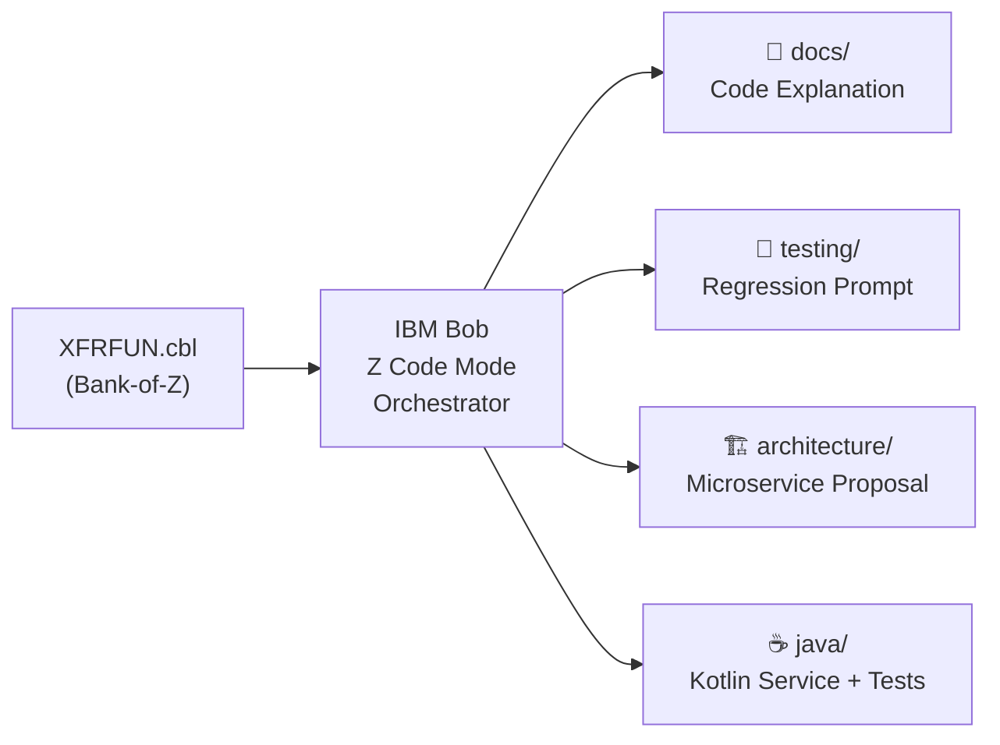

# Legacy Modernization Accelerator

> **IBM Bob Hackathon 2026**  
> **Team:** Jorge Hernandez & Stephanie Rojas


---

## Problem

Enterprise mainframe codebases contain decades of critical business logic encoded in COBOL programs running under CICS and DB2. Understanding, documenting, testing, and modernizing these programs is a slow, high-risk, and highly manual process — typically measured in **weeks or months per program**, bottlenecked by the scarcity of COBOL expertise and the absence of modern tooling for automated artifact generation.

The full modernization lifecycle requires:

- Reading and understanding thousands of lines of COBOL
- Documenting business rules and data flows for architects and developers
- Building regression test suites before making any changes
- Proposing cloud-native service decompositions
- Producing equivalent Java/Kotlin implementations for the target platform

Without automation, each of these phases is a separate manual engagement.

---

## Solution

The **Legacy Modernization Accelerator** is a Bob-powered workflow that uses **Z Code mode** and **parallel subagents** to analyze IBM Z COBOL programs and generate the full suite of modernization artifacts — automatically — reducing the manual effort from weeks to minutes.

Focused on [`XFRFUN.cbl`](https://github.com/IBM/Bank-of-Z/tree/main/src/base/cics/cobol/XFRFUN.cbl) from the [Bank-of-Z](https://github.com/IBM/Bank-of-Z) reference application, the accelerator reads the source program once and fans out into four parallel generation tasks, each producing a production-ready artifact in `Legacy-Modernization/`.

---

## Artifacts Generated

| Artifact | File | Description |
|---|---|---|
| 📖 Code Explanation | [`docs/XFRFUN-explanation.md`](docs/XFRFUN-explanation.md) | Full technical walkthrough — business rules, COMMAREA interface, program flow (Mermaid), DB2 interactions, abend codes, deadlock strategy, known limitations |
| 🧪 Regression Test Prompt | [`testing/XFRFUN-regression-prompt.md`](testing/XFRFUN-regression-prompt.md) | AI prompt for test generation + 15-case human-readable test matrix covering all paths, edge cases, and failure modes |
| 🏗️ Microservice Proposal | [`architecture/XFRFUN-microservice-proposal.md`](architecture/XFRFUN-microservice-proposal.md) | Decomposition into 4 services, Saga pattern design, REST API contract, COBOL→microservice mapping table, Strangler Fig migration plan |
| ☕ Kotlin Equivalent | [`java/TransferService.kt`](java/TransferService.kt) | Production-quality Spring Boot service replicating all XFRFUN business logic with KDoc traceability back to COBOL sections |
| 🧪 Kotlin Tests | [`java/TransferServiceTest.kt`](java/TransferServiceTest.kt) | 18 JUnit 5 + Mockito regression tests covering every scenario in the test matrix |
| 🤖 Agent Design | [`Agents.md`](Agents.md) | Bob agent orchestration design — how the 4 parallel subagents were structured, tools used, and used prompts to reproduce the full workflow |

---

## Tech Stack

| Layer | Technology |
|---|---|
| AI Assistant | IBM Bob (Z Code mode + Agent mode) |
| Source Program | COBOL CICS/DB2 — `XFRFUN.cbl` (Bank-of-Z, IBM Corp. 2023) |
| Target Language | Kotlin + Spring Boot 3 |
| Persistence | Spring Data JPA + DB2 / PostgreSQL |
| Resilience | Resilience4j (retry, circuit breaker) |
| Testing | JUnit 5 + Mockito |
| Observability | OpenTelemetry |
| Reference App | [IBM Bank-of-Z](https://github.com/IBM/Bank-of-Z) |

---

## How It Works



1. Bob reads `XFRFUN.cbl` and its COMMAREA copybook `XFRFUN.cpy`
2. Z Code mode provides deep COBOL/CICS/DB2 context
3. Four **parallel subagents** each generate one artifact independently
4. All output is written into `Legacy-Modernization/` for review and use

> See [`Agents.md`](Agents.md) for the full agent design, tools breakdown, and used prompts to reproduce this workflow.

---

## Repository Structure

```
Legacy-Modernization/
├── README.md                          ← This file
├── Agents.md                          ← Agent design + reconstructed prompts
├── docs/
│   └── XFRFUN-explanation.md          ← Technical explanation
├── testing/
│   └── XFRFUN-regression-prompt.md   ← Regression test prompt + matrix
├── architecture/
│   └── XFRFUN-microservice-proposal.md ← Microservice design
└── java/
    ├── TransferService.kt             ← Kotlin Spring Boot implementation
    └── TransferServiceTest.kt         ← JUnit 5 regression tests
```

---

## Team

| Name | Role |
|---|---|
| **Jorge Hernandez** | IBM Bob Hackathon 2026 |
| **Stephanie Rojas** | IBM Bob Hackathon 2026 |

---

## Security

See [SECURITY.MD](SECURITY.MD) for credential and secret handling guidelines.

---

*Built with [IBM Bob](https://www.ibm.com/products/ibm-watsonx-code-assistant) — AI-powered mainframe modernization.*
