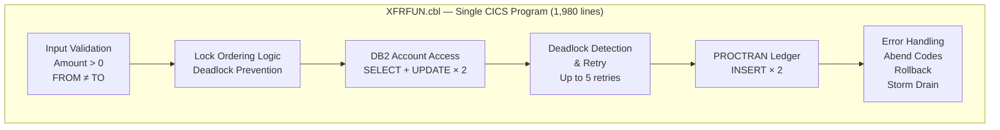
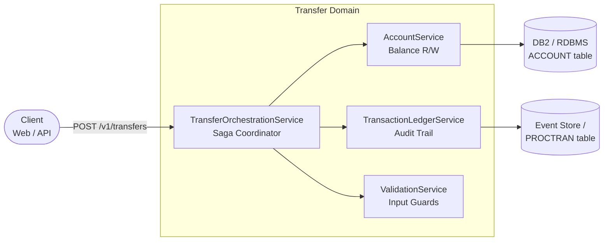
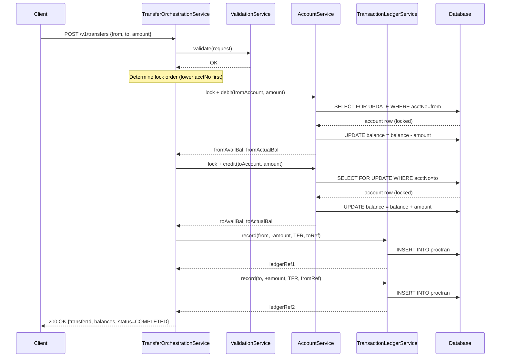
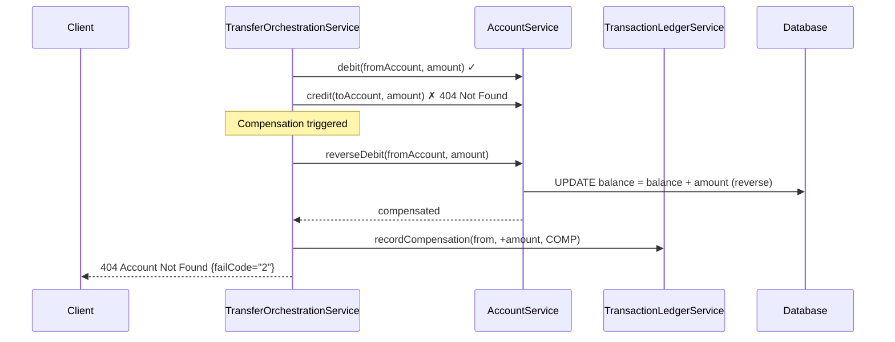

# XFRFUN — Microservice Architecture Proposal

> **Program:** XFRFUN (Transfer Funds)  
> **Source:** `Bank-Of-Z/src/base/cics/cobol/XFRFUN.cbl`  
> **Modernization Target:** Cloud-native REST microservices (Kotlin / Spring Boot)  

---

## 1. Executive Summary

`XFRFUN` encapsulates a critical banking capability — atomic fund transfer between two accounts — in a single 1,980-line COBOL program running under CICS/DB2. While the program functions correctly and includes thoughtful engineering (deadlock prevention via lock ordering, storm drain integration, structured abend handling), it carries the architectural constraints typical of legacy mainframe monoliths:

- Business logic, data access, transaction management, and error handling are tightly coupled in a single compilation unit
- The CICS runtime is a hard dependency
- Testing requires a full z/OS environment
- No horizontal scalability
- No independent deployability of sub-functions

This document proposes a **microservice decomposition** of XFRFUN using the Strangler Fig pattern, resulting in independently deployable, cloud-native services that preserve all existing business rules while gaining testability, observability, and scalability.

---

## 2. Current State Analysis

### 2.1 Monolith Characteristics



### 2.2 Key Coupling Issues

| Concern | Current Implementation | Problem |
|---|---|---|
| Validation | Inline `IF` checks at top of `PREMIERE` | Cannot be tested or reused independently |
| DB2 access | Embedded SQL throughout | Cannot swap data store without rewriting program |
| Transaction management | `EXEC CICS SYNCPOINT ROLLBACK` sprinkled across 800 lines | Complex rollback logic is error-prone and hard to maintain |
| Deadlock retry | `GO TO UPDATE-ACCOUNT-DB2` (restart) with retry counter in LOCAL-STORAGE | Non-standard control flow; difficult to reason about |
| Audit logging | Two hardcoded `INSERT INTO PROCTRAN` statements | Tightly coupled to transaction success path; no dead-letter handling |
| Error reporting | Repeated ABNDINFO-REC population across 20+ code sites | Code duplication ~400 lines |

---

## 3. Target Microservice Architecture

### 3.1 Service Map



### 3.2 Service Definitions

#### a. `TransferOrchestrationService`
**Responsibility:** Saga coordinator. Owns the transfer workflow end-to-end.

| Property | Value |
|---|---|
| Endpoint | `POST /v1/transfers` |
| Pattern | Orchestration Saga |
| Transaction | Distributed (compensating transactions) |
| Equivalent COBOL | `PREMIERE` + `UPDATE-ACCOUNT-DB2` sections |

Steps executed (in order):
1. Call `ValidationService.validate(request)`
2. Determine lock order (lower account number first — same as COBOL)
3. Call `AccountService.debitAccount(from, amount)` — with pessimistic lock
4. Call `AccountService.creditAccount(to, amount)` — with pessimistic lock
5. Call `TransactionLedgerService.record(from, -amount, "TFR", toRef)`
6. Call `TransactionLedgerService.record(to, +amount, "TFR", fromRef)`
7. Commit — return `TransferResult`

On any step failure: execute compensating transactions in reverse order.

#### b. `AccountService`
**Responsibility:** Owns account data. Reads and updates balances.

| Property | Value |
|---|---|
| Endpoints | `GET /v1/accounts/{id}`, `PUT /v1/accounts/{id}/balance` |
| Owns | `ACCOUNT` table (or equivalent) |
| Locking | Pessimistic lock (`SELECT FOR UPDATE`) on balance update |
| Equivalent COBOL | `UPDATE-ACCOUNT-DB2-FROM` + `UPDATE-ACCOUNT-DB2-TO` sections |

#### c. `TransactionLedgerService`
**Responsibility:** Append-only audit ledger. Records all completed transactions.

| Property | Value |
|---|---|
| Endpoint | `POST /v1/transactions` |
| Owns | `PROCTRAN` table / event store |
| Idempotency | Idempotency key = transfer ID + account side (FROM/TO) |
| Equivalent COBOL | `WRITE-TO-PROCTRAN-DB2` section |

#### d. `ValidationService` (internal to Orchestration)
**Responsibility:** Pre-flight input validation.

| Check | COBOL Equivalent | Error Response |
|---|---|---|
| `amount > 0` | `IF COMM-AMT <= ZERO` | HTTP 400, failCode=4 |
| `from ≠ to` | `IF COMM-FACCNO = COMM-TACCNO AND ...` | HTTP 409, failCode=SAME |
| Account existence | Pre-check before locking | HTTP 404 |

---

## 4. Saga Pattern Design

### 4.1 Orchestration vs Choreography

**Recommendation: Orchestration**

XFRFUN's control flow is inherently imperative — it drives each step and decides what happens next based on results. An orchestration saga mirrors this naturally. Choreography (event-driven, no central coordinator) would require multiple services to react to events and track state externally, adding complexity without proportional benefit for a two-account transfer.

### 4.2 Happy Path Sequence



### 4.3 Failure / Compensation Sequence



---

## 5. REST API Contract

### Request

```
POST /v1/transfers
Content-Type: application/json

{
  "fromSortCode":      "987654",
  "fromAccountNumber": "00000001",
  "toSortCode":        "987654",
  "toAccountNumber":   "00000099",
  "amount":            "250.00"
}
```

### Success Response — HTTP 200

```json
{
  "transferId":            "550e8400-e29b-41d4-a716-446655440000",
  "status":                "COMPLETED",
  "fromAvailableBalance":  "250.00",
  "fromActualBalance":     "250.00",
  "toAvailableBalance":    "450.00",
  "toActualBalance":       "450.00",
  "timestamp":             "2024-03-15T14:32:10Z"
}
```

### Error Responses

| HTTP Status | Condition | COBOL Equivalent |
|---|---|---|
| `400 Bad Request` | Amount ≤ 0 | `COMM-FAIL-CODE = '4'` |
| `404 Not Found` | FROM or TO account does not exist | `COMM-FAIL-CODE = '1'` or `'2'` |
| `409 Conflict` | FROM and TO are the same account | Abend `SAME` |
| `422 Unprocessable` | Business rule violation (future: overdraft limit) | Not currently in XFRFUN |
| `500 Internal Server Error` | DB error, compensation failed | Abend `FROM`, `TO`, `HROL`, `RUF2/3`, `WPCD/WPCT` |
| `503 Service Unavailable` | Database connection lost (storm drain equivalent) | `SQLCODE 923` + storm drain |

---

## 6. Deadlock / Concurrency Strategy

### Current COBOL Approach (XFRFUN)
- **Prevention:** Always update the account with the lower account number first
- **Detection:** Check `SQLCODE -911` + `SQLERRD(3)` value
- **Recovery:** `SYNCPOINT ROLLBACK`, `EXEC CICS DELAY FOR SECONDS(1)`, restart up to 5 times

### Modern Equivalent

| COBOL Mechanism | Modern Replacement |
|---|---|
| Account number ordering | Same ordering applied before `SELECT FOR UPDATE` |
| `SQLCODE -911` detection | Catch `CannotAcquireLockException` / `PessimisticLockingFailureException` |
| Fixed 1-second delay | Exponential backoff with jitter (`Resilience4j Retry`) |
| Max 5 retries (counter in LOCAL-STORAGE) | Configurable retry policy (`maxAttempts=5, waitDuration=1s, multiplier=1.5`) |
| `GO TO UPDATE-ACCOUNT-DB2` (restart) | Retry wraps entire `@Transactional executeTransfer()` method |
| Storm drain (DB2 conn lost) | Circuit breaker opens on `DataAccessResourceFailureException` |

```kotlin
// Resilience4j configuration — replaces COBOL deadlock retry + storm drain
val retryConfig = RetryConfig.custom<TransferResult>()
    .maxAttempts(5)
    .waitDuration(Duration.ofSeconds(1))
    .retryExceptions(CannotAcquireLockException::class.java)
    .build()

val circuitBreakerConfig = CircuitBreakerConfig.custom()
    .failureRateThreshold(50f)
    .waitDurationInOpenState(Duration.ofSeconds(30))
    .recordExceptions(DataAccessResourceFailureException::class.java)
    .build()
```

---

## 7. COBOL-to-Microservice Mapping Table

| COBOL Element | Section | Microservice Equivalent |
|---|---|---|
| `IF COMM-AMT <= ZERO` | PREMIERE | `ValidationService` → HTTP 400, failCode=4 |
| `IF COMM-FACCNO = COMM-TACCNO` | UAD010 | `ValidationService` → HTTP 409, failCode=SAME |
| Account number ordering (`IF COMM-FACCNO < COMM-TACCNO`) | UAD010 | `TransferOrchestrationService` lock-order determination |
| `EXEC CICS SYNCPOINT ROLLBACK` | UAD010 | Saga compensating transactions |
| ABEND `SAME` | UAD010 | HTTP 409 Conflict |
| ABEND `FROM` | UAD010 | HTTP 500 Internal Server Error + alert |
| ABEND `TO` | UAD010 | HTTP 500 Internal Server Error + alert |
| ABEND `HROL` | UAD010 | Compensation chain failed → HTTP 500 + dead-letter event + alert |
| `SELECT FROM ACCOUNT` | UADF010 | `AccountService.getAccount(fromId)` with pessimistic lock |
| `UPDATE ACCOUNT` (debit) | UADF010 | `AccountService.debitAccount(fromId, amount)` |
| `COMM-FAIL-CODE = '1'` (FROM not found) | UADF010 | `AccountService` → HTTP 404, failCode=1 |
| `COMM-FAIL-CODE = '3'` (DB2 error) | UADF010 | `AccountService` → HTTP 500, failCode=3 |
| `SELECT FROM ACCOUNT` | UADT010 | `AccountService.getAccount(toId)` with pessimistic lock |
| `UPDATE ACCOUNT` (credit) | UADT010 | `AccountService.creditAccount(toId, amount)` |
| `COMM-FAIL-CODE = '2'` (TO not found) + rollback | UADT010 | `AccountService` → HTTP 404 + saga compensation |
| `SQLCODE -911` deadlock retry | UADT010 | `Resilience4j Retry` on `CannotAcquireLockException` |
| `EXEC CICS DELAY FOR SECONDS(1)` | UADT010 | `RetryConfig.waitDuration(1s)` |
| `DB2-DEADLOCK-RETRY` counter | UADT010 | `RetryConfig.maxAttempts(5)` |
| ABEND `RUF2/RUF3` | UADT010 | Retry exhausted → HTTP 503 + alert |
| `INSERT INTO PROCTRAN` (FROM debit) | WTPD010 | `TransactionLedgerService.record(from, -amount)` |
| `INSERT INTO PROCTRAN` (TO credit) | WTPD010 | `TransactionLedgerService.record(to, +amount)` |
| ABEND `WPCD` (PROCTRAN FROM write fail) | WTPD010 | `TransactionLedgerService` retry → dead-letter queue on exhaustion |
| ABEND `WPCT` (PROCTRAN TO write fail) | WTPD010 | `TransactionLedgerService` retry → dead-letter queue on exhaustion |
| `SQLCODE 923` storm drain | CFSDD010 | `Resilience4j CircuitBreaker` opens on DB unavailability |
| VSAM AFCR/AFCS/AFCT storm drain | ABEND-HANDLING | `CircuitBreaker` records failures; opens after threshold |
| `EXEC CICS ASSIGN APPLID/TASKNO/TRANID` | Multiple | OpenTelemetry trace context (traceId, spanId) |
| `EXEC CICS LINK PROGRAM(ABNDPROC)` | Multiple | Structured logging + distributed tracing + alerting |
| `EXEC CICS RETURN` | GET-ME-OUT-OF-HERE | HTTP response return |

---

## 8. Migration Strategy — Strangler Fig

### Phase 1 — REST Wrapper (Now — already partially in place)
Bank-of-Z already exposes XFRFUN via **z/OS Connect** REST gateway. This is the starting Strangler Fig entry point. New callers call the REST API; XFRFUN continues to run unchanged underneath.

```
[REST Client] → [z/OS Connect] → [CICS] → [XFRFUN.cbl]
```

### Phase 2 — Extract AccountService
Create a standalone `AccountService` microservice. Migrate the `ACCOUNT` table DB2 access behind it. XFRFUN calls `AccountService` via HTTP instead of executing SQL directly. Keep XFRFUN running but hollow out DB2 code.

### Phase 3 — Extract TransactionLedgerService
Create `TransactionLedgerService`. Migrate `PROCTRAN` inserts. XFRFUN calls it instead of executing SQL directly. Optionally publish events to Kafka for downstream consumers.

### Phase 4 — Replace CICS Orchestration
Implement `TransferOrchestrationService` in Spring Boot. Wire it to `AccountService` and `TransactionLedgerService`. Route new transfers through the Spring Boot orchestrator. Run XFRFUN in shadow/comparison mode.

### Phase 5 — Decommission XFRFUN
Once confidence is established (traffic comparison, regression tests passing), remove the z/OS Connect route pointing at XFRFUN. Decommission the CICS program. 

---

## 9. Technology Recommendations

| Concern | Recommendation | Replaces |
|---|---|---|
| Service framework | Kotlin + Spring Boot 3 | CICS runtime |
| DB access | Spring Data JPA + `SELECT FOR UPDATE` | Embedded DB2 SQL |
| Retry / backoff | Resilience4j `Retry` | `DB2-DEADLOCK-RETRY` + `EXEC CICS DELAY` |
| Circuit breaker | Resilience4j `CircuitBreaker` | Storm Drain (CPSM WLM) |
| Distributed tracing | OpenTelemetry + Jaeger | CICS task/transaction IDs in DISPLAYs |
| Async ledger writes | Apache Kafka or IBM MQ | Synchronous `INSERT INTO PROCTRAN` |
| API gateway | IBM API Connect or Kong | z/OS Connect |
| Testing | JUnit 5 + Mockito + Testcontainers | z/OS Unit Testing |
| CI/CD | GitHub Actions / Tekton | DBB (Dependency Based Build) |

---

*Generated by Bob — IBM Z Modernization Assistant*  
*Source: Bank-Of-Z `XFRFUN.cbl` (IBM Corp. 2023)*
