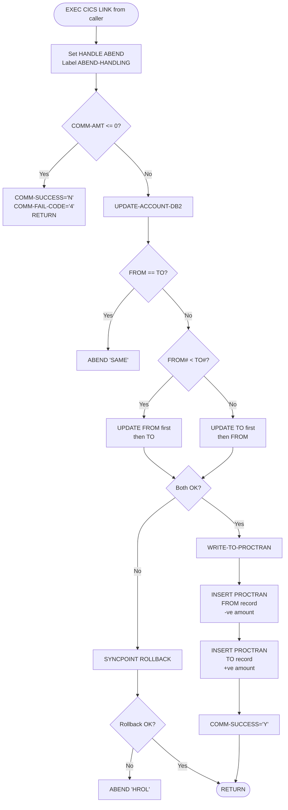

# XFRFUN — Fund Transfer Program: Technical Explanation

> **Source:** `Bank-Of-Z/src/base/cics/cobol/XFRFUN.cbl`  
> **Copybook (COMMAREA):** `Bank-Of-Z/src/base/cics/copy/XFRFUN.cpy`  
> **Copyright:** IBM Corp. 2023  
> **Author:** Jon Collett

---

## 1. Executive Summary

`XFRFUN` is a CICS/DB2 COBOL program that performs **bank-to-bank account fund transfers**. It is invoked when a customer initiates a transfer over the counter or via a web application. The program atomically debits one account, credits another, and writes two transaction ledger records — all within a single DB2 unit of work managed by CICS.

**Key capabilities:**
- Validates the transfer request (amount > 0, source ≠ destination)
- Executes DB2 SELECT + UPDATE on the `ACCOUNT` table for both accounts
- Writes two `PROCTRAN` (Processed Transaction) records as an audit trail
- Handles DB2 deadlocks with automatic retry (up to 5 attempts)
- Rolls back atomically on any failure
- Integrates with CPSM WLM Storm Drain for workload protection under DB2 overload

---

## 2. Architecture Context

```
Caller (BNK1TFN / web API)
        │
        │  EXEC CICS LINK / COMMAREA
        ▼
   ┌─────────────┐      SQL      ┌──────────────┐
   │   XFRFUN    │◄─────────────►│  DB2 (DSNDB) │
   │  (CICS pgm) │               │  ACCOUNT     │
   └─────────────┘               │  PROCTRAN    │
        │                        └──────────────┘
        │  EXEC CICS LINK
        ▼
   ABNDPROC (abend handler)
```

- **Runtime environment:** CICS Transaction Server for z/OS
- **Data store:** IBM DB2 for z/OS (embedded SQL, pre-compiled)
- **Transaction boundary:** CICS UOW — one SYNCPOINT covers both account updates and both PROCTRAN inserts
- **Called by:** `BNK1TFN` (Transfer Function UI screen handler), and indirectly by z/OS Connect REST gateway
- **Abend handler:** `ABNDPROC` — linked via `EXEC CICS LINK` before each abend for structured diagnostics

---

## 3. COMMAREA Interface

Defined in [`XFRFUN.cpy`](../../Bank-Of-Z/src/base/cics/copy/XFRFUN.cpy):

| Field | Picture | Direction | Description |
|---|---|---|---|
| `COMM-FACCNO` | `PIC 9(8)` | Input | FROM account number |
| `COMM-FSCODE` | `PIC 9(6)` | Input | FROM sort code |
| `COMM-TACCNO` | `PIC 9(8)` | Input | TO account number |
| `COMM-TSCODE` | `PIC 9(6)` | Input | TO sort code |
| `COMM-AMT` | `PIC S9(10)V99` | Input | Transfer amount (signed, 2 decimal places) |
| `COMM-FAVBAL` | `PIC S9(10)V99` | Output | FROM account available balance (post-transfer) |
| `COMM-FACTBAL` | `PIC S9(10)V99` | Output | FROM account actual balance (post-transfer) |
| `COMM-TAVBAL` | `PIC S9(10)V99` | Output | TO account available balance (post-transfer) |
| `COMM-TACTBAL` | `PIC S9(10)V99` | Output | TO account actual balance (post-transfer) |
| `COMM-FAIL-CODE` | `PIC X` | Output | Failure reason code (see below) |
| `COMM-SUCCESS` | `PIC X` | Output | `'Y'` = success, `'N'` = failure |

**Failure codes (`COMM-FAIL-CODE`):**

| Code | Meaning |
|---|---|
| `'1'` | FROM account not found (SQLCODE +100 on FROM SELECT) |
| `'2'` | TO account not found (SQLCODE +100 on TO SELECT) |
| `'3'` | DB2 error (non-zero, non-+100 SQLCODE) |
| `'4'` | Amount is zero or negative |

---

## 4. Program Flow

### 4.1 High-Level Flowchart



### 4.2 Section Walkthrough

#### `PREMIERE` / `A010` — Entry Point
1. Registers `ABEND-HANDLING` label via `EXEC CICS HANDLE ABEND`
2. Initialises DB2 host variables
3. Moves the installation sort code to both `COMM-FSCODE` and `COMM-TSCODE`
4. Checks `COMM-AMT <= ZERO` — if so, sets fail code `'4'` and returns immediately
5. Calls `UPDATE-ACCOUNT-DB2`
6. Calls `GET-ME-OUT-OF-HERE` (`EXEC CICS RETURN`)

#### `UPDATE-ACCOUNT-DB2` / `UAD010` — Orchestrator
- **Same-account guard:** If `COMM-FACCNO = COMM-TACCNO` AND `COMM-FSCODE = COMM-TSCODE`, populates `ABNDINFO-REC` and issues `EXEC CICS ABEND ABCODE('SAME')`
- **Lock ordering:** Compares `COMM-FACCNO` and `COMM-TACCNO` numerically. The account with the **lower account number is always updated first** — this is a classic deadlock prevention technique (consistent lock ordering).
  - If `COMM-FACCNO < COMM-TACCNO`: calls `UPDATE-ACCOUNT-DB2-FROM`, then `UPDATE-ACCOUNT-DB2-TO`
  - If `COMM-FACCNO >= COMM-TACCNO`: calls `UPDATE-ACCOUNT-DB2-TO`, then `UPDATE-ACCOUNT-DB2-FROM`
- On any sub-section failure: issues `EXEC CICS SYNCPOINT ROLLBACK` and exits via `GO TO UAD999`
- On success: calls `WRITE-TO-PROCTRAN`, sets `COMM-SUCCESS = 'Y'`

#### `UPDATE-ACCOUNT-DB2-FROM` / `UADF010` — Debit Account
1. Sets host variables `HV-ACCOUNT-SORTCODE` and `HV-ACCOUNT-ACC-NO` from COMMAREA
2. Executes `SELECT` on `ACCOUNT` table for the FROM account
3. If `SQLCODE ≠ 0`:
   - `+100` → `COMM-FAIL-CODE = '1'` (not found)
   - Other → `COMM-FAIL-CODE = '3'` (DB2 error)
   - Calls `CHECK-FOR-STORM-DRAIN-DB2`, exits
4. Computes new balances: `AVAIL-BAL -= COMM-AMT`, `ACTUAL-BAL -= COMM-AMT`
5. Executes `UPDATE` on `ACCOUNT` (full-row rewrite pattern)
6. If update fails: `COMM-FAIL-CODE = '3'`, exits
7. Stores results in `COMM-FAVBAL` and `COMM-FACTBAL`

#### `UPDATE-ACCOUNT-DB2-TO` / `UADT010` — Credit Account
1. Initialises host variables for the TO account
2. Executes `SELECT` on `ACCOUNT` table for the TO account
3. If `SQLCODE ≠ 0`:
   - `+100` → `COMM-FAIL-CODE = '2'`, issues **immediate** `SYNCPOINT ROLLBACK`, returns
   - `-911` with `SQLERRD(3) = 13172872` → **DB2 deadlock detected**:
     - Increments `DB2-DEADLOCK-RETRY`
     - If retry count < 6: `SYNCPOINT ROLLBACK`, `EXEC CICS DELAY FOR SECONDS(1)`, `GO TO UPDATE-ACCOUNT-DB2` (full restart)
     - If retry exhausted: abend `RUF2`
   - `-911` with `SQLERRD(3) = 13172894` → DB2 timeout, abend `RUF2`
   - Other: abend `RUF2`
4. Computes new balances: `AVAIL-BAL += COMM-AMT`, `ACTUAL-BAL += COMM-AMT`
5. Executes `UPDATE` on `ACCOUNT`
6. If update fails: same deadlock/timeout retry logic applies, abend `RUF3` on fatal error
7. Stores results in `COMM-TAVBAL` and `COMM-TACTBAL`

#### `WRITE-TO-PROCTRAN-DB2` / `WTPD010` — Audit Trail
1. Gets current timestamp via `EXEC CICS ASKTIME` / `EXEC CICS FORMATTIME`
2. **FROM debit record:** `PROCTRAN_AMOUNT = COMM-AMT * -1` (negative = debit), description references TO account
3. Executes `INSERT INTO PROCTRAN` — abend `WPCD` on failure
4. **TO credit record:** `PROCTRAN_AMOUNT = COMM-AMT` (positive = credit), description references FROM account
5. Executes `INSERT INTO PROCTRAN` — abend `WPCT` on failure

#### `CHECK-FOR-STORM-DRAIN-DB2` / `CFSDD010`
- Evaluates `SQLCODE`:
  - `923` → sets `STORM-DRAIN-CONDITION = 'DB2 Connection lost'`, displays message
  - Other → no action
- Does **not** abend — leaves storm drain handling to CPSM WLM

#### `ABEND-HANDLING` / `AH010`
Activated by `EXEC CICS HANDLE ABEND LABEL(ABEND-HANDLING)` at program start:
- `AD2Z` — DB2 deadlock: displays full SQLCA diagnostics (SQLSTATE, SQLERRMC, all SQLERRD fields)
- `AFCR` / `AFCS` / `AFCT` — VSAM RLS abends: sets storm drain flag, issues `SYNCPOINT ROLLBACK`

---

## 5. Business Rules

1. **Amount must be positive:** `COMM-AMT` must be `> 0`. Zero or negative values are rejected before any DB2 access.
2. **No self-transfer:** A transfer from an account to itself (same sort code + account number) is rejected with abend `SAME`.
3. **Consistent lock ordering:** Accounts are always updated in ascending account-number order, regardless of which is FROM and which is TO. This prevents circular waits and DB2 deadlocks.
4. **Atomic transfer:** Both account updates and both PROCTRAN records are committed in a single CICS UOW. If either update fails, both are rolled back.
5. **No overdraft check:** The program intentionally does not enforce overdraft limits. Comments in the source note this as a deliberate design decision (`"No checking is made on overdraft limits"`).
6. **Balanced ledger:** Two PROCTRAN records are always written: a negative (debit) record for the FROM account and a positive (credit) record for the TO account.
7. **Deadlock resilience:** Up to 5 automatic retries on DB2 deadlock (-911), each with a 1-second delay and full transaction restart.

---

## 6. DB2 Interaction

### Tables Accessed

| Table | Operations | When |
|---|---|---|
| `ACCOUNT` | `SELECT` | Read FROM account balances |
| `ACCOUNT` | `UPDATE` | Write new FROM account balances (debit) |
| `ACCOUNT` | `SELECT` | Read TO account balances |
| `ACCOUNT` | `UPDATE` | Write new TO account balances (credit) |
| `PROCTRAN` | `INSERT` | Write FROM debit transaction record |
| `PROCTRAN` | `INSERT` | Write TO credit transaction record |

### Key SQL Pattern — Full-Row Rewrite

Rather than updating only the balance columns, XFRFUN reads the entire `ACCOUNT` row, modifies the balance fields in COBOL working storage, then writes the entire row back via `UPDATE ... SET col1=:hv1, col2=:hv2, ...`. This is a common COBOL/DB2 pattern that simplifies code but carries a risk of overwriting concurrent updates to non-balance fields.

### SQLCODE Handling

| SQLCODE | Source | Meaning | Action |
|---|---|---|---|
| `0` | Any | Success | Continue |
| `+100` | SELECT FROM | Row not found | `FAIL-CODE='1'`, exit |
| `+100` | SELECT TO | Row not found | `FAIL-CODE='2'`, rollback, exit |
| `-911` | Any | Deadlock / timeout | Retry or abend |
| `-911` + `SQLERRD(3)=13172872` | TO section | Deadlock | Retry up to 5× |
| `-911` + `SQLERRD(3)=13172894` | TO section | Timeout | Abend RUF2 |
| `923` | Any | DB2 connection lost | Storm drain flag |
| Other non-zero | Any | DB2 error | `FAIL-CODE='3'`, exit / abend |

---

## 7. Error Handling and Abend Codes

| Abend Code | Section | Cause | Recovery |
|---|---|---|---|
| `SAME` | UAD010 | FROM and TO are the same account | None — immediate abend |
| `FROM` | UAD010 | Unexpected error updating FROM account | None — abend after ABNDPROC link |
| `TO` | UAD010 | Unexpected error updating TO account | None — abend after ABNDPROC link |
| `HROL` | UAD010 | `SYNCPOINT ROLLBACK` itself failed | None — catastrophic, abend |
| `RUF2` | UADT010 | Fatal error on TO account SELECT or UPDATE | None — abend after ABNDPROC link |
| `RUF3` | UADT010 | Fatal error on TO account UPDATE | None — abend after ABNDPROC link |
| `WPCD` | WTPD010 | Cannot write FROM debit record to PROCTRAN | None — data inconsistency alert |
| `WPCT` | WTPD010 | Cannot write TO credit record to PROCTRAN | None — data inconsistency alert |
| `AD2Z` | ABEND-HANDLING | DB2 deadlock abend (not retried at handler level) | Diagnostics display only |

> ⚠️ **WPCD / WPCT are particularly dangerous:** By the time these abends are issued, both ACCOUNT rows have already been updated. The PROCTRAN insert failure leaves the accounts updated but with no audit trail — a true data inconsistency. The program displays a diagnostic message but abends without rolling back the account updates.

---

## 8. Deadlock Handling Strategy

XFRFUN implements a two-layer deadlock defence:

### Layer 1 — Prevention (Lock Ordering)
Before any DB2 access, the program compares `COMM-FACCNO` and `COMM-TACCNO`. The account with the **numerically lower account number is always locked first**. Since all concurrent transfer requests follow the same ordering rule, circular waits cannot form between two transactions trying to lock the same pair of accounts in opposite order.

### Layer 2 — Detection and Retry
If DB2 reports a deadlock (`SQLCODE -911`, `SQLERRD(3) = 13172872`):
1. Increment `DB2-DEADLOCK-RETRY` counter (LOCAL-STORAGE, per-invocation)
2. If counter < 6: issue `SYNCPOINT ROLLBACK`, wait 1 second (`EXEC CICS DELAY FOR SECONDS(1)`), restart from `UPDATE-ACCOUNT-DB2`
3. If counter ≥ 6: abend `RUF2` — retry limit exhausted

The `LOCAL-STORAGE` section ensures the retry counter is **per-task** (not shared across CICS tasks), which is correct behaviour for a CICS multi-tasking environment.

---

## 9. Storm Drain / Workload Management

XFRFUN integrates with **CPSM WLM (CICSPlex SM Workload Manager) Storm Drain**:

- `SQLCODE 923` (DB2 connection lost) sets `STORM-DRAIN-CONDITION` and logs a message, but does **not** abend immediately. It relies on WLM to detect the elevated abend/failure rate across the region and route new work away.
- VSAM RLS abend codes `AFCR`, `AFCS`, `AFCT` in `ABEND-HANDLING` set `WS-STORM-DRAIN = 'Y'` and perform a `SYNCPOINT ROLLBACK` before allowing the storm drain mechanism to take effect.
- This design separates the program's local error handling from the regional workload management decision, which is made externally by CPSM.

---

## 10. Known Limitations and Modernization Notes

| Limitation | Notes |
|---|---|
| **No overdraft check** | Explicitly out of scope. A modernized service should add this as a configurable business rule. |
| **Full-row UPDATE** | Rewrites all `ACCOUNT` columns, not just balances. Risk of overwriting concurrent non-balance updates. A modernized service should use `UPDATE ... SET balance=balance-amount WHERE ...`. |
| **PROCTRAN inconsistency window** | If PROCTRAN insert fails after ACCOUNT updates, data is inconsistent and there is no automatic compensation. A saga pattern with compensating transactions would eliminate this. |
| **Hardcoded retry count** | 5 retries with 1-second fixed delay. Modern implementations use exponential backoff with jitter. |
| **CICS dependency** | The entire program requires a CICS runtime. Modernization to a REST microservice removes this dependency. |
| **Synchronous, single-threaded** | All work happens in the CICS task thread. An event-driven ledger write (Kafka/MQ) would improve throughput. |
| **`DESIRED-ACC-KEY2` commented out** | Lines 141–143 are dead code — a second key structure is commented out and never used. |
| **Dynamic SQL scaffolding** | `STMTBUF`, `STMTBUF2`, `WS-WANTED`, `WS-WANTED2` and `SQLDA` are included but never used — leftover from a dynamic SQL approach that was abandoned. |

---

*Generated by Bob — IBM Z Modernization Assistant*  
*Source: Bank-Of-Z `XFRFUN.cbl` (1,980 lines, IBM Corp. 2023)*
